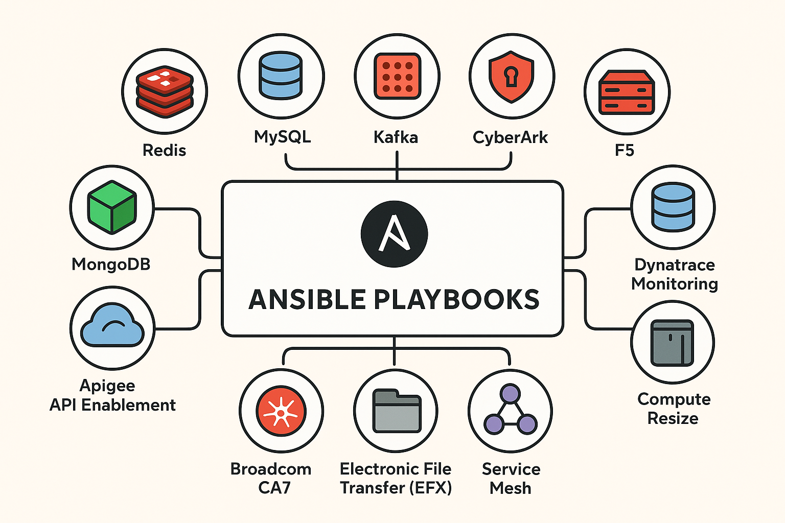

# Lightspeed Generated Playbooks



Ansible automation playbooks designed for **Ansible Automation Platform (AAP)**, accelerating infrastructure and application provisioning across multiple platforms and services.

---

## Overview

The **lightspeed-generated-playbooks** repository houses Ansible playbooks optimized for Ansible Automation Platform. These playbooks provide:

- **Self-service automation** through AAP surveys and job templates
- **Template-based configuration generation** with validation
- **Git workflow automation** (branching, commits, pull requests)
- **Consistent deployments** across environments
- **Audit trails** through git integration

All playbooks are designed to run directly from AAP with no CLI interaction required.

---

## Available Automations

### Redis Configuration
**Path:** `redis/`  
**Job Template:** `LG: Redis Configuration Generator`

Automated Redis cluster configuration generation with GitHub Pull Request creation.

**Features:**
- Template-based Redis cluster configuration
- Automated PR creation via GitHub API
- YAML validation
- Support for HA, sharding, replication, TLS

**Survey Variables:**
- Cluster details (name, master nodes)
- Redis/BDB versions
- Database configuration (memory, ports, sharding)
- Git repository settings
- GitHub token for PR automation

See [redis/README.md](redis/README.md) for detailed documentation.

---

### Apigee API Management
**Path:** `apigee/`

Create new applications in Apigee API Gateway.

**Playbook:** `create_new_app_in_apigee.yml`

---

### DataPower Gateway
**Path:** `datapower/`

IBM DataPower gateway configuration automation.

**Playbooks:**
- `create_proxy.yml` - Create API proxies
- `create_wsgateway_rest.yml` - Create WebSocket gateways with REST

---

### F5 Load Balancer
**Path:** `f5/`

F5 BIG-IP software installation and configuration.

**Playbook:** `install_software_big_ip.yml`

---

### Cloud Compute
**Path:** `compute-resize/`

Azure VM resize operations.

**Playbook:** `resize_azure_vm.yml`

---

## Prerequisites

### For AAP Execution
- Ansible Automation Platform 2.4+
- Appropriate credentials configured in AAP:
  - Machine credentials (if needed)
  - Source Control credentials (for git operations)
  - Custom credentials (GitHub tokens, API keys)
- Network access to target systems
- Execution environments with required collections

### For Development/Testing
- Ansible >= 2.15
- Python 3.9+
- Git
- Access to target infrastructure

---

## Repository Structure

```
lightspeed-generated-playbooks/
├── redis/                          # Redis cluster configuration automation
│   ├── create_pr_for_redis_aap.yml
│   ├── templates/
│   └── README.md
├── apigee/                         # Apigee API management
│   └── create_new_app_in_apigee.yml
├── datapower/                      # IBM DataPower gateway
│   ├── create_proxy.yml
│   └── create_wsgateway_rest.yml
├── f5/                            # F5 BIG-IP automation
│   └── install_software_big_ip.yml
├── compute-resize/                # Cloud compute operations
│   └── resize_azure_vm.yml
├── files/
│   └── graphic.png
└── README.md
```

---

## Usage in Ansible Automation Platform

### Job Template Setup

1. **Create Project** in AAP pointing to this repository
2. **Create Job Template** selecting the appropriate playbook
3. **Configure Survey** for user-friendly variable input
4. **Add Credentials** as needed (GitHub tokens, API keys, etc.)
5. **Launch Job** - all execution handled by AAP

### Example: Redis Configuration Job

**Job Template Configuration:**
- **Name:** `LG: Redis Configuration Generator`
- **Project:** `Lightspeed Generated Playbooks`
- **Playbook:** `redis/create_pr_for_redis_aap.yml`
- **Inventory:** `Demo Inventory` (localhost)
- **Credentials:** (optional) GitHub token as extra variable

**Survey Configuration:**
The survey collects all necessary inputs including cluster details, versions, database configuration, and GitHub settings.

**Execution:**
1. User fills out survey with cluster specifications
2. Job generates Redis configuration from template
3. Automatically creates git branch and commits changes
4. Creates Pull Request via GitHub API
5. Outputs PR URL for review and approval

---

## Development & Testing

### Local Testing (Optional)

While these playbooks are designed for AAP, you can test them locally:

```bash
# Clone repository
git clone <repo-url>
cd lightspeed-generated-playbooks

# Test playbook syntax
ansible-playbook --syntax-check redis/create_pr_for_redis_aap.yml

# Run with variables file
ansible-playbook redis/create_pr_for_redis_aap.yml \
  -e @vars.yml \
  -e github_token=your_token
```

### Adding New Playbooks

1. Create directory for new automation
2. Add playbook with clear task names and descriptions
3. Include README.md documenting variables and usage
4. Test in AAP dev environment
5. Create job template and survey
6. Update this README with new automation details

---

## Documentation

Each automation includes its own README with:
- Detailed variable documentation
- Prerequisites and requirements
- AAP survey configuration examples
- Troubleshooting guidance

---

## Security Best Practices

- **Use AAP Credentials** - Store all sensitive data in AAP credential types
- **GitHub Tokens** - Use personal access tokens with minimal required scopes
- **Secrets Management** - Never commit tokens or passwords to git
- **Branch Protection** - Enable branch protection on target repositories
- **PR Reviews** - Require approvals before merging generated configurations
- **Audit Logging** - AAP automatically tracks all job executions

---

## Support

For questions or issues:
- **Repository:** File GitHub issues
- **AAP Access:** Contact your AAP administrator
- **Playbook Issues:** Check individual playbook README files

---

## Labels

Use these labels in AAP for organization:
- `ai` - AI-assisted playbook generation
- `lspgen` - Lightspeed generated content
- `redis` - Redis-related automation
- `api` - API integration playbooks
