# Redis Cluster Configuration Automation (AAP)

Automated Redis cluster configuration generation designed for **Ansible Automation Platform**. This automation generates Redis cluster configuration files from templates and automatically creates Bitbucket Pull Requests for team review and deployment.

---

## Overview

This automation provides:
- **Template-based configuration generation** for Redis Enterprise clusters
- **Automated git workflow** (branch creation, commit, push)
- **Pull Request automation** using Bitbucket API (no CLI required)
- **YAML validation** of generated configurations
- **AAP Survey integration** for user-friendly input
- **Audit trail** through git history
- **Dual authentication support** (Bearer token and Basic Auth)

**Job Template:** `LG: Redis Configuration Generator`  
**Playbook:** `redis/create_pr_for_redis_aap.yml`

---

## Running from AAP

### Prerequisites in AAP

1. **Project Setup**
   - Project synced to this repository
   - Default branch: `main`

2. **Job Template Configuration**
   - **Name:** `LG: Redis Configuration Generator`
   - **Inventory:** `Demo Inventory` (localhost)
   - **Playbook:** `redis/create_pr_for_redis_aap.yml`
   - **Execution Environment:** Default EE with Ansible 2.15+

3. **Credentials (Required for PR Creation)**
   - **Bitbucket Username** (your Bitbucket username)
   - **Bitbucket API Token** (Workspace or Personal Access Token)
   - Pass as extra variables: `bitbucket_username` and `bitbucket_api_token`
   - ⚠️ **IMPORTANT:** Must be a Workspace or Personal Access Token (NOT Repository Access Token)

4. **Survey Enabled**
   - Survey collects all required configuration inputs
   - Refer to survey variables section below for complete field list

---

## AAP Survey Configuration

### Survey Setup in Job Template

When creating or editing your Job Template in AAP, enable the **Survey** feature and add the following fields:

### Survey Variables

### Cluster Information
| Variable | Description | Example | Required |
|----------|-------------|---------|----------|
| `cluster_name` | Primary cluster hostname | `mbf-redis-XXX.example.com` | ✓ |
| `cluster_master` | Primary master node | `lmbfXXXa.prod.example.com` | ✓ |
| `cluster_name_active` | Active/DR cluster hostname | `mbf-redis-XXX-dr.example.com` | Optional |
| `cluster_master_active` | Active/DR master node | `lmbfXXXb.prod.example.com` | Optional |

### Environment & Versions
| Variable | Description | Example | Required |
|----------|-------------|---------|----------|
| `environment` | Target environment | `development`, `staging`, `production` | ✓ |
| `redis_version` | Redis Enterprise version | `7.8.6-60` | ✓ |
| `bdb_version` | Database version | `7.4.0` | ✓ |
| `featureset_version` | Feature set version | `8` | ✓ |

### Database Configuration
| Variable | Description | Example | Required |
|----------|-------------|---------|----------|
| `database_name` | Database name | `mbf` | ✓ |
| `database_port` | Database port | `10000` | ✓ |
| `memory_size_gb` | Memory allocation in GB | `8` | ✓ |
| `sharding_enabled` | Enable sharding | `true`, `false` | ✓ |
| `shards_count` | Number of shards | `1` | If sharding enabled |
| `replication_enabled` | Enable replication | `true`, `false` | ✓ |
| `tls_mode` | TLS configuration | `enabled`, `disabled` | ✓ |
| `data_persistence` | Data persistence mode | `enabled`, `disabled` | ✓ |
| `slave_ha_enabled` | Enable slave HA | `enabled`, `disabled` | ✓ |

### Git & Bitbucket Settings
| Variable | Description | Example | Required |
|----------|-------------|---------|----------|
| `git_repo_url` | Target repository URL | `https://bitbucket.org/workspace/redis-configs.git` | ✓ |
| `git_default_branch` | Base branch for PRs | `main` | Default: `main` |
| `create_pull_request` | Create PR automatically | `yes`, `no` | Default: `yes` |
| `bitbucket_username` | Bitbucket username | `chrhamme` | ✓ (for PR) |
| `bitbucket_api_token` | Bitbucket API token (Workspace/Personal) | `ATBBxxxxx...` | ✓ (for PR) |
| `pr_reviewers_list` | Comma-separated reviewers | `user1,user2` | Optional |

### Advanced Settings (Defaults Provided)
| Variable | Description | Default |
|----------|-------------|---------|
| `slave_ha_grace_period` | HA grace period (seconds) | `120` |
| `slave_ha_cooldown_period` | HA cooldown period (seconds) | `240` |
| `slave_ha_bdb_cooldown_period` | BDB cooldown period (seconds) | `360` |

---

## Detailed Survey Field Configuration

Use these specifications when creating survey fields in your AAP Job Template:

### Required Text Fields

| Variable Name | Prompt | Answer Type | Default | Min/Max | Required |
|---------------|--------|-------------|---------|---------|----------|
| `cluster_name` | Primary Cluster Hostname | Text | | 1/255 | ✓ |
| `cluster_master` | Primary Master Node | Text | | 1/255 | ✓ |
| `cluster_name_active` | Active/DR Cluster Hostname | Text | | 0/255 | |
| `cluster_master_active` | Active/DR Master Node | Text | | 0/255 | |
| `database_name` | Database Name | Text | `mbf` | 1/64 | ✓ |
| `git_repo_url` | Bitbucket Repository URL | Text | | 1/500 | ✓ |
| `bitbucket_username` | Bitbucket Username | Text | | 1/100 | ✓ |

### Required Password Fields

| Variable Name | Prompt | Answer Type | Default | Required |
|---------------|--------|-------------|---------|----------|
| `bitbucket_api_token` | Bitbucket API Token (Workspace/Personal) | Password | | ✓ |

### Required Integer Fields

| Variable Name | Prompt | Answer Type | Default | Min/Max | Required |
|---------------|--------|-------------|---------|---------|----------|
| `database_port` | Database Port | Integer | `10000` | 1024/65535 | ✓ |
| `memory_size_gb` | Memory Size (GB) | Integer | `8` | 1/1024 | ✓ |
| `shards_count` | Number of Shards | Integer | `1` | 1/512 | ✓ |

### Required Multiple Choice (Single Select)

| Variable Name | Prompt | Choices | Default | Required |
|---------------|--------|---------|---------|----------|
| `environment` | Target Environment | `development`<br>`staging`<br>`production` | `development` | ✓ |
| `sharding_enabled` | Enable Sharding | `true`<br>`false` | `false` | ✓ |
| `replication_enabled` | Enable Replication | `true`<br>`false` | `true` | ✓ |
| `tls_mode` | TLS Mode | `enabled`<br>`disabled` | `enabled` | ✓ |
| `data_persistence` | Data Persistence | `enabled`<br>`disabled` | `enabled` | ✓ |
| `slave_ha_enabled` | Enable Slave HA | `enabled`<br>`disabled` | `enabled` | ✓ |
| `create_pull_request` | Create Pull Request | `yes`<br>`no` | `yes` | ✓ |

### Version Fields (Text)

| Variable Name | Prompt | Answer Type | Example | Required |
|---------------|--------|-------------|---------|----------|
| `redis_version` | Redis Enterprise Version | Text | `7.8.6-60` | ✓ |
| `bdb_version` | Database Version | Text | `7.4.0` | ✓ |
| `featureset_version` | Feature Set Version | Text | `8` | ✓ |

### Optional Text Fields

| Variable Name | Prompt | Answer Type | Default | Required |
|---------------|--------|-------------|---------|----------|
| `git_default_branch` | Base Branch for PRs | Text | `main` | |
| `pr_reviewers_list` | PR Reviewers (comma-separated) | Text | | |

### Survey Tips

1. **Order Fields Logically:**
   - Group related fields together (cluster info, database config, git settings)
   - Place required fields before optional ones
   - Put credentials near the end

2. **Use Validation:**
   - Set min/max values for integers
   - Use regex for hostnames if needed: `^[a-zA-Z0-9.-]+$`
   - Validate ports: 1024-65535

3. **Provide Helpful Prompts:**
   - Include examples in the prompt text
   - Mention format requirements
   - Add warnings for sensitive fields

4. **Default Values:**
   - Provide sensible defaults where possible
   - Document defaults in the prompt

5. **Token Field Security:**
   - Set `bitbucket_api_token` as **Password** type
   - Add note in prompt: "Must be Workspace or Personal Access Token (NOT Repository token)"

---

## Workflow

### Automated Process

```mermaid
graph LR
    A[User Launches Job] --> B[Fill Survey]
    B --> C[Job Execution Starts]
    C --> D[Validate Prerequisites]
    D --> E[Clone Git Repository]
    E --> F[Create Feature Branch]
    F --> G[Generate Configuration]
    G --> H[Validate YAML]
    H --> I[Commit & Push]
    I --> J[Create Bitbucket PR]
    J --> K[Display PR URL]
```



### What the Job Does

1. **Prerequisite Checks**
   - Validates git, python3, PyYAML availability
   - Checks Bitbucket credentials if PR creation enabled
   - Detects token type (warns if Repository Access Token)

2. **Git Operations**
   - Configures git credentials using provided token
   - Clones target repository
   - Normalizes git remote URL with embedded credentials
   - Creates timestamped feature branch

3. **Bitbucket Authentication Testing**
   - Tests Bearer token authentication
   - Falls back to Basic Auth if Bearer fails
   - Validates API access to user endpoint
   - Verifies repository access permissions
   - Displays which authentication method succeeded

4. **Configuration Generation**
   - Applies survey inputs to Jinja2 template
   - Generates Redis cluster configuration file
   - Validates YAML syntax

5. **Git Workflow**
   - Stages generated configuration file
   - Commits with descriptive message
   - Pushes branch to remote repository

6. **Pull Request Creation**
   - Calls Bitbucket API to create PR (using detected auth method)
   - Sets PR title and detailed description
   - Adds reviewers if specified
   - Outputs PR URL for review

---

## Generated Output

### File Naming Convention
```
redis_cluster_<sanitized_cluster_name>_<timestamp>.yml
```

**Example:**
```
redis_cluster_mbf_redis_XXX_example_com_1760660319.yml
```

### Output Location
```
<git_repo>/deployments/redis_cluster_<name>_<timestamp>.yml
```

### Git Branch Naming
```
redis-deployment-<cluster-name>-<timestamp>
```

**Example:**
```
redis-deployment-mbf-redis-XXX-example-com-1760660319
```

---

## Bitbucket Authentication

### ⚠️ CRITICAL: Token Type Requirements

**You MUST use a Workspace Access Token or Personal Access Token**

❌ **DO NOT USE:** Repository Access Tokens (these will fail!)

Repository Access Tokens (starting with `ATATT...`) do NOT work for:
- API endpoint `/2.0/user`
- Git push operations
- Pull request creation

### Workspace Access Token Setup (Recommended)

1. **Navigate to Workspace Settings**
   - Log in to Bitbucket Cloud
   - Click on your **Workspace name** (not repository!)
   - Click **Settings** in the left sidebar
   - Click **Access tokens** under "Workspace settings"

2. **Create Token**
   - Click **"Create Access Token"**
   - Name: `AAP Redis Automation`
   - Set expiration (optional, recommended 90-365 days)

3. **Select Required Scopes** (CRITICAL)
   - ☑️ **Workspace: Read**
   - ☑️ **Projects: Write**
   - ☑️ **Repositories: Write**
   - ☑️ **Pull requests: Write**

4. **Create and Copy**
   - Click **Create**
   - **Copy the token immediately** (you won't see it again!)
   - Token format: `ATBBxxxxx...` (Workspace token)

### Personal Access Token Setup (Alternative)

1. **Navigate to Personal Settings**
   - Log in to Bitbucket Cloud
   - Click on your profile icon → **Personal settings**
   - Click **Access tokens** in the left sidebar

2. **Create Token**
   - Click **"Create Access Token"**
   - Use same scopes as Workspace token above

### Store in AAP

1. **Option 1: Survey Variables**
   - Add `bitbucket_username` field to survey
   - Add `bitbucket_api_token` field to survey (password type)

2. **Option 2: Extra Variables**
   - Pass as extra variables when launching job:
     ```yaml
     bitbucket_username: your_username
     bitbucket_api_token: ATBBxxxxx...
     ```

3. **Option 3: Custom Credential Type**
   - Create custom credential type in AAP
   - Inject as extra variables

4. **Security:**
   - Never commit tokens to git
   - Set token expiration dates
   - Rotate tokens regularly

### Token Usage

- **Git Authentication**: Token embedded in git URL for HTTPS push operations
- **API Authentication**: Playbook tests both Bearer and Basic Auth methods
- **Automatic Detection**: Uses whichever authentication method works
- **Masked Output**: Token is masked in job output for security

---

## Job Output

### Successful Execution
```
All prerequisites passed
Token prefix detected: ATBB***
Bitbucket API authentication: SUCCESS ✓
Authentication method: BEARER
Repository access check: SUCCESS ✓
Configuration generated: redis_cluster_mbf_redis_XXX_example_com_1760660319.yml
YAML validation: PASSED
Branch created: redis-deployment-mbf-redis-XXX-example-com-1760660319
Changes committed and pushed
Pull Request created successfully!

PR #42: Redis Cluster Deployment: mbf-redis-XXX.example.com (development)
URL: https://bitbucket.org/workspace/redis-configs/pull-requests/42
Status: OPEN
```

### Without Bitbucket Credentials
```
WARNING: Pull Request not created automatically
Reason: Bitbucket credentials not provided

Please create the PR manually:
  Repository: https://bitbucket.org/workspace/redis-configs.git
  Branch: redis-deployment-mbf-redis-XXX-example-com-1760660319
  Title: Redis Cluster Deployment: mbf-redis-XXX.example.com (development)
  URL: https://bitbucket.org/workspace/redis-configs/pull-requests/new?source=redis-deployment-xxx&dest=main

Configuration file generated and pushed successfully
```

### Authentication Failure (Wrong Token Type)
```
Token prefix detected: ATATT***
WARNING: This looks like a Repository Access Token (ATATT prefix) - these do NOT work!
You need a Workspace or Personal Access Token instead!

Bitbucket API authentication: FAILED ✗

╔════════════════════════════════════════════════════════════════╗
║  Bitbucket API Authentication Failed (401 Unauthorized)        ║
╚════════════════════════════════════════════════════════════════╝

❌ BOTH authentication methods failed!
   Token starts with: ATATT*** (Repository Access Token)

Error from Bitbucket API:
"Token is invalid, expired, or not supported for this endpoint."

⚠️  WRONG TOKEN TYPE CONFIRMED!

[Detailed instructions for creating correct token type...]
```

---

## Troubleshooting

### Job Fails at "Clone git repository"

**Symptoms:**
- Job hangs or fails with authentication error
- Error: `Permission denied (publickey)` or `Authentication failed`
- Error: `could not read Password for 'https://...'`

**Solution:**
1. Ensure `bitbucket_username` and `bitbucket_api_token` are provided
2. Verify token is a **Workspace or Personal Access Token** (not Repository)
3. Check token hasn't expired
4. Confirm repository URL is correct (e.g., `https://bitbucket.org/workspace/repo.git`)
5. Verify token has **Repositories: Write** scope

### Job Fails at "Bitbucket API Authentication"

**Symptoms:**
- Error: `401 Unauthorized`
- Message: "Token is invalid, expired, or not supported for this endpoint"
- Token prefix shows: `ATATT***`

**Solution:**
1. **WRONG TOKEN TYPE!** You're using a Repository Access Token
2. Create a **Workspace Access Token** instead:
   - Go to **Workspace Settings** → **Access tokens** (NOT Repository Settings)
   - Required scopes: Workspace:Read, Projects:Write, Repositories:Write, Pull requests:Write
3. Replace the token in your survey/extra variables
4. Token should start with `ATBB...` (Workspace) not `ATATT...` (Repository)

### Job Fails at "Create Pull Request"

**Symptoms:**
- Configuration generated and pushed successfully
- PR creation fails with API error
- Authentication tests passed

**Debug Steps:**
1. Check Bitbucket API error in job output
2. Verify token has **Pull requests: Write** scope
3. Confirm base branch (`main`) exists in repository
4. Check if branch protection rules allow PRs
5. Verify workspace/repository slug extraction from URL
6. Ensure authentication method (BEARER or BASIC) was detected

**Common API Errors:**
- `401 Unauthorized` - Wrong token type or expired
- `403 Forbidden` - Token lacks required scopes
- `404 Not Found` - Repository doesn't exist or token lacks access
- `409 Conflict` - PR already exists for this branch

### YAML Validation Fails

**Symptoms:**
- Job fails at "Validate generated YAML file"

**Solution:**
1. Check template file: `templates/redis_cluster_config.yml.j2`
2. Review survey inputs for special characters
3. Examine generated file in job output
4. Verify all required variables provided

### Variable Undefined Errors

**Symptoms:**
- `AnsibleUndefinedVariable: 'variable_name' is undefined`

**Solution:**
1. Check survey configuration - ensure field is present
2. Verify variable name matches playbook expectations
3. Review default values in playbook `vars` section
4. Confirm extra variables syntax if providing manual overrides

---

## Files Structure

```
redis/
├── create_pr_for_redis_aap.yml        # Main AAP playbook
├── example_vars.yml                   # Example variables (reference only)
├── requirements.yml                   # Required Ansible collections
├── templates/
│   └── redis_cluster_config.yml.j2    # Configuration template
└── README.md                          # This file
```

---

## Customization

### Template Modifications

To modify the generated Redis configuration format:

1. Edit `templates/redis_cluster_config.yml.j2`
2. Test changes locally or in dev AAP environment
3. Commit template changes to git
4. AAP project will sync updated template

### Default Values

Default values are defined in the playbook's `vars` section:
- HA grace periods
- LDAP URLs
- Default passwords (should be overridden!)

**Location:** Lines 10-23 in `create_pr_for_redis_aap.yml`

### Adding New Variables

1. Add variable to playbook `vars` section with default
2. Update survey to collect user input
3. Add variable to Jinja2 template as needed
4. Update this README documentation

---

## Security Best Practices

1. **Bitbucket Tokens**
   - **Use Workspace or Personal Access Tokens ONLY**
   - Never use Repository Access Tokens (they don't work!)
   - Set minimum required scopes:
     - Workspace: Read
     - Projects: Write
     - Repositories: Write
     - Pull requests: Write
   - Set token expiration (90-365 days recommended)
   - Rotate tokens regularly
   - Never commit tokens to git
   - Store tokens in AAP credentials or vault

2. **Sensitive Data**
   - Use Ansible Vault for passwords in templates
   - Pass secrets via AAP credentials
   - Review generated configs before merging
   - Use `no_log: true` for sensitive tasks

3. **Repository Access**
   - Limit who can launch AAP jobs (RBAC in AAP)
   - Enable branch protection on target Bitbucket repo
   - Require PR reviews before merge
   - Use Bitbucket merge checks and build validations

4. **Audit Trail**
   - AAP logs all job executions with user attribution
   - Git history tracks all configuration changes
   - PRs provide review and approval workflow
   - Bitbucket tracks all API access attempts

---

## Additional Documentation

- **[example_vars.yml](example_vars.yml)** - Example variable structure
- **[requirements.yml](requirements.yml)** - Required Ansible collections
- **[templates/redis_cluster_config.yml.j2](templates/redis_cluster_config.yml.j2)** - Configuration template

---

## Support

**For Issues:**
- Job failures: Check AAP job output and this troubleshooting section
- Template issues: Review `templates/redis_cluster_config.yml.j2`
- Bitbucket API issues: Verify token type and permissions
- Authentication errors: See "Bitbucket Authentication" section above

**Resources:**
- Bitbucket API Documentation: https://developer.atlassian.com/cloud/bitbucket/rest/
- Bitbucket Access Tokens: https://support.atlassian.com/bitbucket-cloud/docs/access-tokens/
- AAP Documentation: https://access.redhat.com/documentation/en-us/red_hat_ansible_automation_platform
- Repository: File issues via Bitbucket

---

*Designed for Ansible Automation Platform - No CLI interaction required*
