# Redis Cluster Configuration Automation (AAP)

Automated Redis cluster configuration generation designed for **Ansible Automation Platform**. This automation generates Redis cluster configuration files from templates and automatically creates GitHub Pull Requests for team review and deployment.

---

## 📌 Overview

This automation provides:
- **Template-based configuration generation** for Redis Enterprise clusters
- **Automated git workflow** (branch creation, commit, push)
- **Pull Request automation** using GitHub API (no CLI required)
- **YAML validation** of generated configurations
- **AAP Survey integration** for user-friendly input
- **Audit trail** through git history

**Job Template:** `LG: Redis Configuration Generator`  
**Playbook:** `redis/create_pr_for_redis_aap.yml`

---

## 🚀 Running from AAP

### Prerequisites in AAP

1. **Project Setup**
   - Project synced to this repository
   - Default branch: `main`

2. **Job Template Configuration**
   - **Name:** `LG: Redis Configuration Generator`
   - **Inventory:** `Demo Inventory` (localhost)
   - **Playbook:** `redis/create_pr_for_redis_aap.yml`
   - **Execution Environment:** Default EE with Ansible 2.15+

3. **Credentials (Optional but Recommended)**
   - **GitHub Personal Access Token** (for PR creation)
   - Pass as extra variable: `github_token`

4. **Survey Enabled**
   - Survey collects all required configuration inputs
   - See [SURVEY_SETUP.md](SURVEY_SETUP.md) for complete survey configuration

### How to Launch

1. Navigate to **Resources → Templates** in AAP
2. Find **LG: Redis Configuration Generator**
3. Click **Launch** button
4. Fill out the survey with cluster details:
   - Cluster information (name, master nodes)
   - Environment (development, staging, production)
   - Redis and BDB versions
   - Database configuration (memory, ports, sharding)
   - Git repository URL
   - GitHub settings (PR creation, token)
5. Click **Next** → **Launch**
6. Monitor job execution in real-time
7. Copy PR URL from job output

---

## 📋 Survey Variables

### Cluster Information
| Variable | Description | Example | Required |
|----------|-------------|---------|----------|
| `cluster_name` | Primary cluster hostname | `mbf-redis-XXX.example.com` | ✓ |
| `cluster_master` | Primary master node | `lmbfXXXa.prod.example.com` | ✓ |
| `cluster_name_active` | Active/DR cluster hostname | `mbf-redis-XXX-dr.example.com` | Optional |
| `cluster_master_active` | Active/DR master node | `lmbfXXXb.prod.example.com` | Optional |

### Environment & Versions
| Variable | Description | Example | Required |
|----------|-------------|---------|----------|
| `environment` | Target environment | `development`, `staging`, `production` | ✓ |
| `redis_version` | Redis Enterprise version | `7.8.6-60` | ✓ |
| `bdb_version` | Database version | `7.4.0` | ✓ |
| `featureset_version` | Feature set version | `8` | ✓ |

### Database Configuration
| Variable | Description | Example | Required |
|----------|-------------|---------|----------|
| `database_name` | Database name | `mbf` | ✓ |
| `database_port` | Database port | `10000` | ✓ |
| `memory_size_gb` | Memory allocation in GB | `8` | ✓ |
| `sharding_enabled` | Enable sharding | `true`, `false` | ✓ |
| `shards_count` | Number of shards | `1` | If sharding enabled |
| `replication_enabled` | Enable replication | `true`, `false` | ✓ |
| `tls_mode` | TLS configuration | `enabled`, `disabled` | ✓ |
| `data_persistence` | Data persistence mode | `enabled`, `disabled` | ✓ |
| `slave_ha_enabled` | Enable slave HA | `enabled`, `disabled` | ✓ |

### Git & GitHub Settings
| Variable | Description | Example | Required |
|----------|-------------|---------|----------|
| `git_repo_url` | Target repository URL | `https://github.com/org/redis-configs.git` | ✓ |
| `git_default_branch` | Base branch for PRs | `main` | Default: `main` |
| `create_pull_request` | Create PR automatically | `yes`, `no` | Default: `yes` |
| `github_token` | GitHub API token | `ghp_xxxxx` | For PR creation |
| `pr_reviewers_list` | Comma-separated reviewers | `user1,user2` | Optional |

### Advanced Settings (Defaults Provided)
| Variable | Description | Default |
|----------|-------------|---------|
| `slave_ha_grace_period` | HA grace period (seconds) | `120` |
| `slave_ha_cooldown_period` | HA cooldown period (seconds) | `240` |
| `slave_ha_bdb_cooldown_period` | BDB cooldown period (seconds) | `360` |

---

## 🔄 Workflow

### Automated Process

```mermaid
graph LR
    A[User Launches Job] --> B[Fill Survey]
    B --> C[Job Execution Starts]
    C --> D[Validate Prerequisites]
    D --> E[Clone Git Repository]
    E --> F[Create Feature Branch]
    F --> G[Generate Configuration]
    G --> H[Validate YAML]
    H --> I[Commit & Push]
    I --> J[Create GitHub PR]
    J --> K[Display PR URL]
```



### What the Job Does

1. **Prerequisite Checks**
   - Validates git, python3, PyYAML availability
   - Checks GitHub token if PR creation enabled

2. **Git Operations**
   - Configures git credentials using provided token
   - Clones target repository
   - Creates timestamped feature branch

3. **Configuration Generation**
   - Applies survey inputs to Jinja2 template
   - Generates Redis cluster configuration file
   - Validates YAML syntax

4. **Git Workflow**
   - Stages generated configuration file
   - Commits with descriptive message
   - Pushes branch to remote repository

5. **Pull Request Creation**
   - Calls GitHub API to create PR
   - Sets PR title and detailed description
   - Adds reviewers if specified
   - Outputs PR URL for review

---

## 📁 Generated Output

### File Naming Convention
```
redis_cluster_<sanitized_cluster_name>_<timestamp>.yml
```

**Example:**
```
redis_cluster_mbf_redis_XXX_example_com_1760660319.yml
```

### Output Location
```
<git_repo>/deployments/redis_cluster_<name>_<timestamp>.yml
```

### Git Branch Naming
```
redis-deployment-<cluster-name>-<timestamp>
```

**Example:**
```
redis-deployment-mbf-redis-XXX-example-com-1760660319
```

---

## 🔐 GitHub Authentication

### Personal Access Token Setup

1. **Create Token in GitHub**
   - Go to GitHub → Settings → Developer Settings → Personal Access Tokens → Tokens (classic)
   - Click "Generate new token (classic)"
   - Set expiration (90 days recommended)
   - Select scopes:
     - ✓ `repo` (Full control of private repositories)
     - ✓ `workflow` (if needed for GitHub Actions)

2. **Store in AAP**
   - Option 1: Pass as extra variable `github_token` when launching
   - Option 2: Create custom credential type in AAP
   - **Never commit tokens to git!**

3. **Token Usage**
   - Playbook automatically embeds token in git URL for HTTPS authentication
   - Token used for GitHub API PR creation
   - Token is masked in job output (`no_log` during debugging)

---

## 📊 Job Output

### Successful Execution
```
✓ All prerequisites passed
✓ Configuration generated: redis_cluster_mbf_redis_XXX_example_com_1760660319.yml
✓ YAML validation: PASSED
✓ Branch created: redis-deployment-mbf-redis-XXX-example-com-1760660319
✓ Changes committed and pushed
✓ Pull Request created successfully!

PR #42: Redis Cluster Deployment: mbf-redis-XXX.example.com (development)
URL: https://github.com/org/redis-configs/pull/42
Status: open
```

### Without GitHub Token
```
⚠ Pull Request not created automatically
Reason: GitHub token not provided

Please create the PR manually:
  Repository: https://github.com/org/redis-configs.git
  Branch: redis-deployment-mbf-redis-XXX-example-com-1760660319
  Title: Redis Cluster Deployment: mbf-redis-XXX.example.com (development)
  URL: https://github.com/org/redis-configs/compare/main...redis-deployment-xxx?expand=1

✓ Configuration file generated and pushed successfully
```

---

## 🛠️ Troubleshooting

### Job Fails at "Clone git repository"

**Symptoms:**
- Job hangs or fails with authentication error
- Error: `Permission denied (publickey)` or `Authentication failed`

**Solution:**
1. Ensure `github_token` is provided and valid
2. Verify token has `repo` scope permissions
3. Check token hasn't expired
4. Confirm repository URL is correct

### Job Fails at "Create Pull Request"

**Symptoms:**
- Configuration generated and pushed successfully
- PR creation fails with API error

**Debug Steps:**
1. Check GitHub API error in job output
2. Verify token has required permissions
3. Confirm base branch (`main`) exists in repository
4. Check if branch protection rules allow PRs
5. Verify repository owner/name extraction from URL

**Common API Errors:**
- `401 Unauthorized` - Invalid or expired token
- `404 Not Found` - Repository doesn't exist or token lacks access
- `422 Unprocessable Entity` - PR already exists or validation error

### YAML Validation Fails

**Symptoms:**
- Job fails at "Validate generated YAML file"

**Solution:**
1. Check template file: `templates/redis_cluster_config.yml.j2`
2. Review survey inputs for special characters
3. Examine generated file in job output
4. Verify all required variables provided

### Variable Undefined Errors

**Symptoms:**
- `AnsibleUndefinedVariable: 'variable_name' is undefined`

**Solution:**
1. Check survey configuration - ensure field is present
2. Verify variable name matches playbook expectations
3. Review default values in playbook `vars` section
4. Confirm extra variables syntax if providing manual overrides

---

## 📂 Files Structure

```
redis/
├── create_pr_for_redis_aap.yml        # Main AAP playbook
├── example_vars.yml                   # Example variables (reference only)
├── requirements.yml                   # Required Ansible collections
├── templates/
│   └── redis_cluster_config.yml.j2    # Configuration template
├── README.md                          # This file
└── SURVEY_SETUP.md                    # AAP survey configuration guide
```

---

## 🔧 Customization

### Template Modifications

To modify the generated Redis configuration format:

1. Edit `templates/redis_cluster_config.yml.j2`
2. Test changes locally or in dev AAP environment
3. Commit template changes to git
4. AAP project will sync updated template

### Default Values

Default values are defined in the playbook's `vars` section:
- HA grace periods
- LDAP URLs
- Default passwords (should be overridden!)

**Location:** Lines 10-23 in `create_pr_for_redis_aap.yml`

### Adding New Variables

1. Add variable to playbook `vars` section with default
2. Update survey to collect user input
3. Add variable to Jinja2 template as needed
4. Update this README documentation

---

## 🔒 Security Best Practices

1. **GitHub Tokens**
   - Use tokens with minimum required scopes
   - Set token expiration (90 days)
   - Rotate tokens regularly
   - Never commit tokens to git

2. **Sensitive Data**
   - Use Ansible Vault for passwords
   - Pass secrets via AAP credentials
   - Review generated configs before merging

3. **Repository Access**
   - Limit who can launch AAP jobs
   - Enable branch protection on target repo
   - Require PR reviews before merge

4. **Audit Trail**
   - AAP logs all job executions
   - Git history tracks all configuration changes
   - PRs provide review and approval workflow

---

## 📖 Additional Documentation

- **[SURVEY_SETUP.md](SURVEY_SETUP.md)** - Complete AAP survey configuration
- **[example_vars.yml](example_vars.yml)** - Example variable structure
- **[requirements.yml](requirements.yml)** - Required Ansible collections

---

## 📞 Support

**For Issues:**
- Job failures: Check AAP job output and this troubleshooting section
- Template issues: Review `templates/redis_cluster_config.yml.j2`
- GitHub API issues: Verify token and permissions

**Resources:**
- GitHub API Documentation: https://docs.github.com/en/rest
- AAP Documentation: https://access.redhat.com/documentation/en-us/red_hat_ansible_automation_platform
- Repository: File issues via GitHub

---

*Designed for Ansible Automation Platform - No CLI interaction required*
